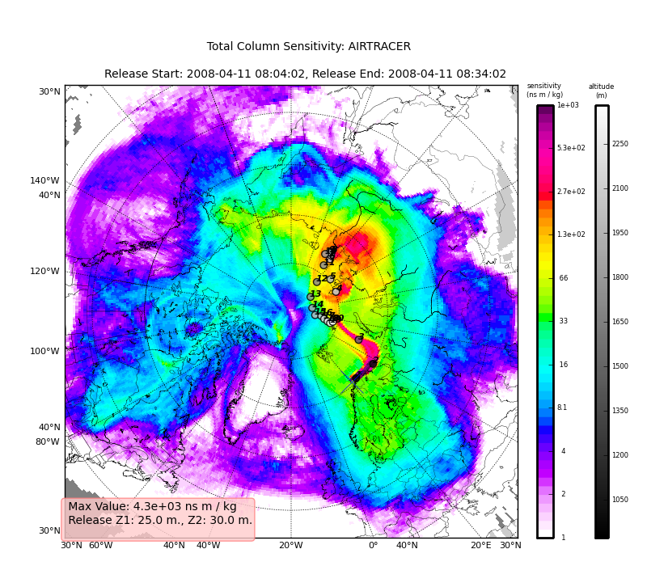

.. _getting_started:

***************
Getting started
***************

.. _installing-docdir:

A quick overview of FLEXPART data
==================================

pflexible was originally developed for working with FLEXPART V8.x which has
some fairly new features to how the output data is created. See the 
documents for information regarding `FLEXPART
<http://transport.nilu.no/flexpart>`_ .

A `users guide <http://zardoz.nilu.no/~andreas/flexpart/flexpart8.pdf>`_ for
FLEXPART is available which explains the model output.

*Note* If you are interested in contributing functionality for other FLEXPART
versions, please contact me.

pflexible was originally released as 'pflexpart', but as the goal is to be more
generic, the package was renamed. The current release is still focused on
FLEXPART, but some generalizations are starting to make their way into the code
base.

pflexible is undergoing *constant* modifications and is not particularly stable
or backward compatible code. I am trying to move in the right direction, and
have moved the code now to bitbucket.org. If you are interested in contributing,
feel free to contact me: `John F. Burkhart <mailto:jfburkhart@gmail.com>`_

----

.. _fetching-example-data:

Fetching example data
---------------------

An example data set is available for testing. The data is from the 
`International Polar Year (IPY) <http://www.ipy.org>`_ `POLARCAT
<http://www.polarcat.no>`_ NOAA-ICEALOT Cruise, and provides retroplume
data for April 14, 2009 from the *R/V Knorr* off the North Coast of Norway.

The data is 1 Gb, I suggest using wget to grab the data::

  > wget http://niflheim.nilu.no/~burkhart/sharing/pflexible_testdata.tgz

  
----
.. _getting-pflexible:

Getting pflexible
=================
Please contact: `John F. Burkhart <jfburkhart@gmail.com>`_

The code is available to the public, but it is presently maintained at bitbucket
with restricted sharing. Upon request, we can bundle the latest release.

Make sure you also have the dependencies installed:
  - numpy
  - matplotlib
  - basemap (matplotlib toolkit)
  - f2py (to build FortFlex)
  - Scientific (not for long)
  - netCDF4

----
.. _setting-pythonpath:

Setting the PYTHONPATH
----------------------

Depending on where you checked out the pflexible module to, you need to make
sure it is accessbile in your PYTHONPATH environment variable. The dependencies
also need to be available in the paths defined here. 

.. note::
   This can be accomplished after you've checked out the software::
      %export PYTHONPATH=/path/to/pflexible

.. sidebar:: Python at NILU

   Setting paths for most dependencies can be accomplished with::
   
    %export PYTHONPATH=$PYTHONPATH:/xnilu_wrk/jfb/hg

   And *hopefully* everything works!.

.. _building-FortFlex:

----
Building FortFlex
=================

Unless you're working on a 64bit Ubuntu machine, you will certainly have to
rebuild the FortFlex module. This is fairly easy. Navigate to the ``f2py_build``
directory. See the README file for instructions, but most likely, you just need
to run the following command::

   %f2py -c --fcompiler=gfortran FortFlex.pyf FortFlex.f

You will need to replace the `fcompiler` with whatever compiler you have. Once
you have built the ``FortFlex.so`` file, copy into the same directory as
``pflexible.py`` or somewhere on your *PYTHONPATH*. **NOTE** I am
trying to replace this dependency (or at least make more builds available, if
you have suggestions, please contact me).

----
.. _testing-pflexible:

Testing pflexible
=================

Once you have checked out the code and have a sufficient FLEXPART dataset to
work with you can begin to use the module. The first step is to load the
module. Depending on how you checked out the code, you can accomplish this in a
few different way, but the preferred is as follows::

    %import pflexible as pf

.. sidebar:: header file

  Don't include the actual header file name, but use *only* the directory name
  within which the header resides. If the header is not named `header`, you can 
  use the optional headerfile argument.

The next step is to read the FLEXPART header file from a dataset::

    %H = pf.Header('/path/to/flexpart/output')

Now you have a variable 'H' which has all the information about the run that is
available from the header file. This 'Header' is essentially a dictionary, so
the first step may be to explore some of the keys::

    %H.keys()

This should produce some output that looks familiar to your from your FLEXPART
run setup.

----
Reasonably, you should now want to read in some of the data from your run. This
is accomplished easlier using the :func:`read_grid
<nilu.pflexible.pflexible.read_grid>`. For optimal
performance, this function will use the FortFlex module. However, as a fall
back there is a pure python method, but it is significantly slower. If you are
having problems compiling :mod:`FortFlex <nilu.pflexible.FortFlex>`, see 
the section above. Either way, the function call looks like::

    > FD = pf.read_grid(H,time_ret=0,nspec_ret=0)

.. note::
  See the :func:`read_grid <nilu.pflexible.pflexible.read_grid>` function 
  for information on the keyword arguments.

At this point you should now have a variable 'FD' which is again a dictionary of
the FLEXPART grids. Look at the keys of the dictionary to see what information
is stored. The actual data is keyed by tuples: (nspec, datestr) where nspec is
the species number and datestr is a YYYYMMDDHHMMSS string for the grid
timestep.

.. warning::
        The following is out of date, I am working on creating some more
        trivial examples.

----
..  Once you have the dataset (and assuming you have the dependencies resolved)
    you are ready to run the :file:`examples/backward_run.py`. First redefine the "
    SOURCE_DIR" and "OUTPUT_DIR" as appropriate. Now, let's first take it for a test drive::
    
       > ./backward_run.py
       
    If all goes well, you can browse to your "OUTPUT_DIR" and you should see some .png files.
    
Okay, let\'s take a look at the example code line by line. The first line imports the module, 
giving it a namespace "pf". The next few lines simply define the paths for "SOURCE_DIR" and 
"OUTPUT_DIR" (you probably already changed these).::

  > import pflexible as pf

The next line creates a :class:`Header` class "H", by passing the path
of the directory (not header path) containing the FLEXPART run.::

  > H = pf.Header(SOURCE_DIR)

.. note::
  This example uses the `methods` of the Header class, :class:`plexpart.Header`.
  You can also call most the methods directly, passing "H" as the first
  argument as in: D = pf.fill_backward(H). In some cases, for some of the
  functions, H can be substituted. See the docstrings for more
  information.

----
H is now an object in your workspace. Using Ipython you can explore the methods
and attributes of H. We call the `fill_backward` method to populate the "D"
attribute (a dictionary) with all the data from the run.::

  > H.fill_backward(nspec=(0,1))

H.D is now keyed by (s,k) where s is an integer for the species #, and k is an
integer for the release id. In the example, I use the :func:`read_trajectories` function
to get the trajectories from the run output directory.::

  > T = pf.read_trajectories(H)

Note, that the only required parameter is the Header "H", this provides all the
metadata for the function to read the trajectories. This is a function that 
accepts simply the "H" instance or a path to a trajectories file.

----
The following lines plot the data sets using the :func:`plot_totalcolumn`, :func:`plot_trajectory`, 
and :func:`plot_footprint`.

.. warning:: 
  There is a lot of reliance on the mapping module in the plot_routines. If you
  have problems, see the :file:`mapping.py` file. Or the :mod:`mapping`
  docstrings. Documentation of this module is presently incomplete but I
  am working on it.

First I create two "None" objects for passing the figure instances around and to
reuse them (for efficiency). After that we loop over the keys (s=species, and
k=rel_i) of the "D" attribute we created by calling `fill_backward`. Note, I named
this attribute "D" for data. In each iteration, for a new combination of s,k we
pull the "data" object out of the dictionary. The "data" object is returned from 
the function :func:`readgridV8` and has some attributes that we can use later
in the :func:`plot_totalcolumn` function and for saving naming the figure.::

  > for s,k in H.D:
  >    data = H.D[(s,k)]
  >    TC = pf.plot_totalcolumn(H,data,region='POLARCAT',FIGURE=TC)
  >    TC = pf.plot_trajectory(H,T,k,FIGURE=TC)

----
plot the total column and overlay the trajectories. The following lines::

  > filename = '%s_tc_%s.png' % (D.species,D.timestamp)
  > ofilename = os.path.join(OUTPUT_DIR,filename)
  > TC.fig.savefig(ofilename)

create filenames and save the figure to the path defined by `ofilename`
comprised of the `OUTPUT_DIR` and the `filename` variables. The
lines following do the same for the footprint sensitivity plots.

If you now browse the :file:`OUTPUT_DIR`, you should find a bunch of .png files
like this:

----
The next step is the use the **source** and learn more about the functionality
of the module. I highly recommend the `Ipython <http::/ipython.scipy.org>`_ 
interpreter and use of the Tab key to explore the modules methods.

Enjoy!

.. toctree::
