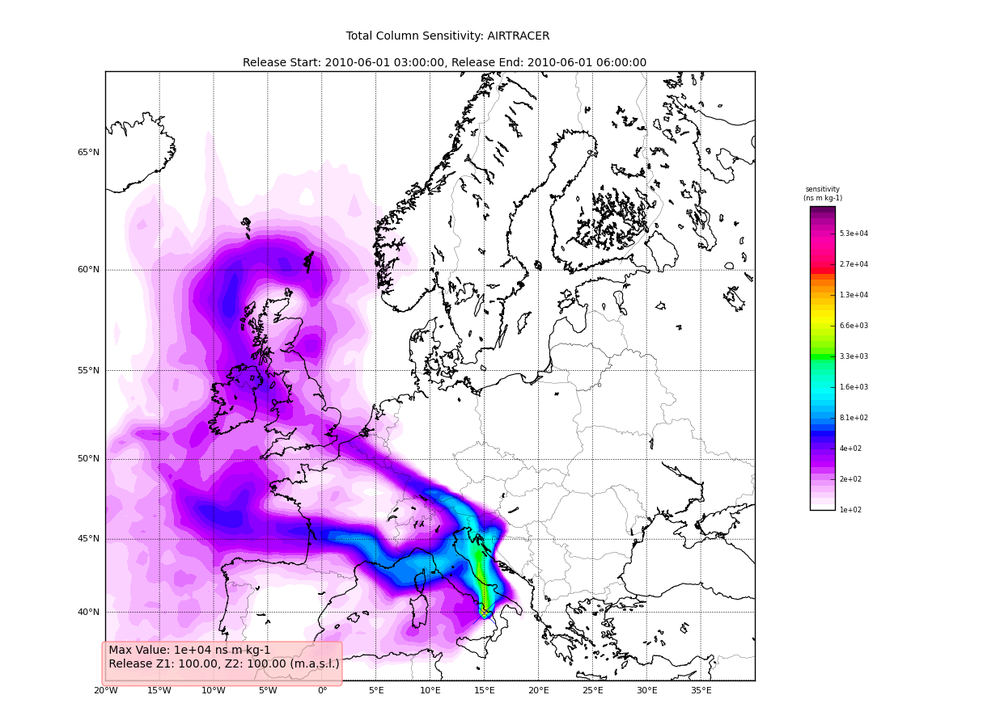

.. _getting_started:

***************
Getting started
***************

.. _installing-docdir:

A quick overview of FLEXPART data
=================================

reflexible was originally developed for working with FLEXPART V8.x
which has some fairly new features to how the output data is
created. The latest version of FLEXPART also has functionality for
saving directly to Netcdf. The ability to read this data directly is
forthcoming, but for now reflexible still only works with the raw
unformatted binary Fortran data FLEXPART has traditionally used for
output.  See the documents for information regarding `FLEXPART
<http://transport.nilu.no/flexpart>`_ .

A `users guide <http://zardoz.nilu.no/~andreas/flexpart/flexpart8.pdf>`_ for
FLEXPART is available which explains the model output.

*Note* If you are interested in contributing functionality for other
FLEXPART versions, please contact me.

reflexible was originally released as 'pflexpart', but as the goal is
to be more generic, the package was renamed. The current release is
still focused on FLEXPART, but some generalizations are starting to
make their way into the code base.

reflexible is undergoing *constant* modifications and is not
particularly stable or backward compatible code. I am trying to move
in the right direction, and have moved the code now to
github.org. If you are interested in contributing, feel free to
contact me: `John F. Burkhart <mailto:jfburkhart@gmail.com>`_

----

.. _fetching-example-data:

Fetching example data
---------------------

An example data set is available for testing. The data contains a
simple backward run case, and thus is suitable for testing some of the
unique functions of reflexible for analysis and creation of the
retroplumes.

I suggest using wget to grab the data::

    $ wget http://folk.uio.no/johnbur/sharing/stads2_V10.tar

----

.. _converting-output-to-netCDF4:

Converting FLEXPART output to netCDF4 format
============================================

Reflexible is using a netCDF4 internally for doing its analysis and
plotting duties.  This section demonstrates how to convert the
FLEXPART output to netCDF4 format. In order to do that the
`create_ncfile` script will be invoked. This script is copied into a
directory in your path when reflexible is installed, so you should not
worry about copying it manually.

Before processing the data in `stads2_V10.tar` we have to
uncompress that file::

    $ cp stads2_V10.tar /tmp
    $ cd /tmp
    $ tar xvf stads2_V10.tar

After untarring, a directory named `stads2_V10` is created. It
contains the result of processing a simple backward run case with
FLEXPART. Next we can execute the `fprun` script::

    $ fprun /tmp/stads2_V10/pathnames
    Flexpart('/tmp/stads2_V10/pathnames', nested=False)

note that you pass the pathnames of a FLEXPART run.  The `pathnames`
file has a simple structure.  For example, in our case it goes like
this::

    $./options/
    ./stads2_15_018.001/
    /
    /.../AVAILABLE_ECMWF_OPER_fields_global
    ============================================

So, basically in the first line indicates the <options> directory for
the FLEXPART run, whereas the second line specifies the <output>
directory.  With this, you can easily mix and match different <options>
and <output> directories for your analysis.

If we want to select the `nested` data instead, just pass the `-n` flag::

    $ fprun -n /tmp/stads2_V10/pathnames
    Flexpart('/tmp/stads2_V10/pathnames', nested=True)

And if you want to get some info on the COMMANDS file::

    $ fprun -n -C /tmp/stads2_V10/pathnames
    $ Flexpart('/tmp/stads2_V10/pathnames', nested=True)
    $ Command: OrderedDict([('CBLFLAG', 0), ('CTL', -5), ('IBDATE', 20150405), ('IBTIME', 103500), ('IEDATE', 20150426), ('IETIME', 130500), ('IFINE', 4), ('IFLUX', 0), ('IND_RECEPTOR', 1), ('IND_SOURCE', 1), ('IOUT', 13), ('IOUTPUTFOREACHRELEASE', 1), ('IPIN', 0), ('IPOUT', 0), ('ITSPLIT', 9999999), ('LAGESPECTRA', 1), ('LCONVECTION', 1), ('LDIRECT', -1), ('LINIT_COND', 0), ('LOUTAVER', 10800), ('LOUTSAMPLE', 900), ('LOUTSTEP', 10800), ('LSUBGRID', 1), ('LSYNCTIME', 900), ('MDOMAINFILL', 0), ('MQUASILAG', 0), ('NESTED_OUTPUT', 1), ('SURF_ONLY', 0)])

You can get more info on the supported flags by passing the `-h` flag to
the `fprun` command line utility::

    $ fprun -h
    usage: fprun [-h] [-n] [-C] [-R] [-S] [-H HEADER_KEY] [-K] [pathnames]

    positional arguments:
      pathnames             The Flexpart pathnames file stating where options and
                            output are. If you pass a dir, a 'pathnames' file will
                            be appended automatically. If not found yet, a FP
                            output dir is assumed.

    optional arguments:
      -h, --help            show this help message and exit
      -n, --nested          Use a nested output.
      -C, --command         Print the COMMAND contents.
      -R, --releases        Print the RELEASES contents.
      -S, --species         Print the SPECIES contents.
      -H HEADER_KEY, --header-key HEADER_KEY
                            Print the contents of H[HEADER_KEY].
      -K, --header-keys     Print all the HEADER keys.

----

.. _reading-netcdf4:

Reading data out of a FLEXPART run
----------------------------------

Newer versions of FLEXPART can generate convenient NetCDF4 files as output,
so let's have a quick glimpse on how you can access the different data on it.

*Note* In case you have a FLEXPART output that is not in NetCDF4 format, you
can always make use the `create_ncfile` command line utility.

Open the file and print meta-information for the run::

    In [1]: from netCDF4 import Dataset

    In [2]: rootgrp = Dataset("/tmp/stads2_V10/stads2_15_018.001/grid_time_20150426130500.nc")

    In [3]: print(rootgrp)
    <class 'netCDF4._netCDF4.Dataset'>
    root group (NETCDF4 data model, file format HDF5):
        Conventions: CF-1.6
        title: FLEXPART model output
        institution: NILU
        source: Version 10.0beta (2015-05-01) model output
        history: 2016-02-02 09:43 +0100  created by  on compute-8-16.local
        references: Stohl et al., Atmos. Chem. Phys., 2005, doi:10.5194/acp-5-2461-200
        outlon0: -179.0
        outlat0: -90.0
        dxout: 0.5
        dyout: 0.5
        ldirect: -1
        ibdate: 20150405
        ibtime: 103500
        iedate: 20150426
        ietime: 130500
        loutstep: -10800
        loutaver: -10800
        loutsample: -900
        itsplit: 9999999
        lsynctime: -900
        ctl: -0.2
        ifine: 1
        iout: 5
        ipout: 0
        lsubgrid: 1
        lconvection: 1
        lagespectra: 1
        ipin: 0
        ioutputforeachrelease: 1
        iflux: 0
        mdomainfill: 0
        ind_source: 1
        ind_receptor: 1
        mquasilag: 0
        nested_output: 1
        surf_only: 0
        linit_cond: 0
        dimensions(sizes): time(168), longitude(720), latitude(360), height(3), numspec(1), pointspec(31), nageclass(1), nchar(45), numpoint(31)
        variables(dimensions): int32 time(time), float32 longitude(longitude), float32 latitude(latitude), float32 height(height), |S1 RELCOM(numpoint,nchar), float32 RELLNG1(numpoint), float32 RELLNG2(numpoint), float32 RELLAT1(numpoint), float32 RELLAT2(numpoint), float32 RELZZ1(numpoint), float32 RELZZ2(numpoint), int32 RELKINDZ(numpoint), int32 RELSTART(numpoint), int32 RELEND(numpoint), int32 RELPART(numpoint), float32 RELXMASS(numspec,numpoint), int32 LAGE(nageclass), int32 ORO(latitude,longitude), float32 spec001_mr(nageclass,pointspec,time,height,latitude,longitude)
        groups:

We can get the info for a specific attribute just by referencing it like this::

    In [4]: print(rootgrp.loutstep)
    -10800

We can have a look at the different dimensions and variables in the file::

    In [5]: print(rootgrp.dimensions)
    OrderedDict([('time', <class 'netCDF4._netCDF4.Dimension'> (unlimited): name = 'time', size = 168
    ), ('longitude', <class 'netCDF4._netCDF4.Dimension'>: name = 'longitude', size = 720
    ), ('latitude', <class 'netCDF4._netCDF4.Dimension'>: name = 'latitude', size = 360
    ), ('height', <class 'netCDF4._netCDF4.Dimension'>: name = 'height', size = 3
    ), ('numspec', <class 'netCDF4._netCDF4.Dimension'>: name = 'numspec', size = 1
    ), ('pointspec', <class 'netCDF4._netCDF4.Dimension'>: name = 'pointspec', size = 31
    ), ('nageclass', <class 'netCDF4._netCDF4.Dimension'>: name = 'nageclass', size = 1
    ), ('nchar', <class 'netCDF4._netCDF4.Dimension'>: name = 'nchar', size = 45
    ), ('numpoint', <class 'netCDF4._netCDF4.Dimension'>: name = 'numpoint', size = 31
    )])

    In [6]: rootgrp.variables.keys()
    Out[11]: odict_keys(['time', 'longitude', 'latitude', 'height', 'RELCOM', 'RELLNG1', 'RELLNG2', 'RELLAT1', 'RELLAT2', 'RELZZ1', 'RELZZ2', 'RELKINDZ', 'RELSTART', 'RELEND', 'RELPART', 'RELXMASS', 'LAGE', 'ORO', 'spec001_mr'])

The `netCDF4` Python wrappers allows to easily slice and dice variables::

    In [15]: longitude = rootgrp.variables['longitude']

    In [16]: print(longitude)
    <class 'netCDF4._netCDF4.Variable'>
    float32 longitude(longitude)
        long_name: longitude in degree east
        axis: Lon
        units: degrees_east
        standard_name: grid_longitude
        description: grid cell centers
    unlimited dimensions:
    current shape = (720,)
    filling on, default _FillValue of 9.969209968386869e+36 used

We see that 'longitude' is a unidimensional variable with shape (720,).
Let's read just the 10 first elements::

    In [20]: longitude[:10]
    Out[20]:
    array([-178.75, -178.25, -177.75, -177.25, -176.75, -176.25, -175.75,
           -175.25, -174.75, -174.25], dtype=float32)

As only the 10 first elements are brought into memory, that permits
to reduce your memory needs for your analysis.

Also, what you get from slicing netCDF4 variables are always NumPy arrays::

    In [21]: type(longitude[:10])
    Out[21]: numpy.ndarray

which, besides of being memory-efficient, they are what you normally
use in your analysis tasks.

Also, each variable can have attached different attributes meant to
add more information about what they are about::

    In [23]: longitude.ncattrs()
    Out[23]: ['long_name', 'axis', 'units', 'standard_name', 'description']

    In [24]: longitude.long_name
    Out[24]: u'longitude in degree east'

    In [25]: longitude.units
    Out[25]: u'degrees_east'

That's is basically all you need to know to access the on-disk data.
Feel free to play a bit more with the netCDF4 interface, because you
will find it very convenient when combined with reflexible.

----

.. _testing-reflexible:

Testing reflexible
==================

Once you have checked out the code and have a sufficient FLEXPART
dataset to work with you can begin to use the module. The first step
is to load the package. Depending on how you checked out the code, you
can accomplish this in a few different way, but the preferred is as
follows::

    In [1]: import reflexible as rf

.. sidebar:: header file

  Don't include the actual header file name, but use *only* the
  directory name within which the header resides. If the header is not
  named `header`, you can use the optional headerfile argument.

The next step is to create the accessor to the FLEXPART run::

    In [2]: fprun = rf.Flexpart("/tmp/stads2_V10/pathnames")

    In [3]: type(fprun)
    Out[3]: reflexible.flexpart.Flexpart

So, `fprun` is an instance of the `Flexpart` class that allows you to
easily access different parts of the FLEXPART run.  For example, we can
access the COMMAND like this::

    In [4]: fprun.Command
    Out[4]:
    OrderedDict([('CBLFLAG', 0),
                 ('CTL', -5),
                 ('IBDATE', 20150405),
                 ('IBTIME', 103500),
                 ('IEDATE', 20150426),
                 ('IETIME', 130500),
                 ('IFINE', 4),
                 ('IFLUX', 0),
                 ('IND_RECEPTOR', 1),
                 ('IND_SOURCE', 1),
                 ('IOUT', 13),
                 ('IOUTPUTFOREACHRELEASE', 1),
                 ('IPIN', 0),
                 ('IPOUT', 0),
                 ('ITSPLIT', 9999999),
                 ('LAGESPECTRA', 1),
                 ('LCONVECTION', 1),
                 ('LDIRECT', -1),
                 ('LINIT_COND', 0),
                 ('LOUTAVER', 10800),
                 ('LOUTSAMPLE', 900),
                 ('LOUTSTEP', 10800),
                 ('LSUBGRID', 1),
                 ('LSYNCTIME', 900),
                 ('MDOMAINFILL', 0),
                 ('MQUASILAG', 0),
                 ('NESTED_OUTPUT', 1),
                 ('SURF_ONLY', 0)])

the SPECIES::

    In [5]: fprun.Species
    Out[5]:
    defaultdict(list,
                {'decay': [-999.9],
                 'dquer': [-9.9],
                 'dryvel': [-9.99],
                 'dsigma': [-9.9],
                 'f0': [-9.9],
                 'henry': [-9.9],
                 'kao': [-99.99],
                 'reldiff': [-9.9],
                 'weightmolar': [350.0]})

or the RELEASES::

    In [7]: fprun.Releases[:10]  # print just the first 10 entries
    Out[7]:
    array([ (20150425, 103500, 20150425, 104000, 11.875, 11.875, 78.92790222167969, 78.92790222167969, 61.854942321777344, 61.854942321777344, 2, 1.0, 100000, b'stads2_15_018_2015115_78.9278631'),
           (20150425, 104000, 20150425, 104500, 11.875, 11.875, 78.92790222167969, 78.92790222167969, 60.942100524902344, 60.942100524902344, 2, 1.0, 100000, b'stads2_15_018_2015115_78.9278631'),
           (20150425, 104500, 20150425, 105000, 11.875, 11.875, 78.92790222167969, 78.92790222167969, 60.92486572265625, 60.92486572265625, 2, 1.0, 100000, b'stads2_15_018_2015115_78.9278631'),
           (20150425, 105000, 20150425, 105500, 11.875, 11.875, 78.92790222167969, 78.92790222167969, 60.91283416748047, 60.91283416748047, 2, 1.0, 100000, b'stads2_15_018_2015115_78.9278631'),
           (20150425, 105500, 20150425, 110000, 11.875, 11.875, 78.92790222167969, 78.92790222167969, 199.36782836914062, 199.36782836914062, 2, 1.0, 100000, b'stads2_15_018_2015115_78.9278631'),
           (20150425, 110000, 20150425, 110500, 11.875, 11.875, 78.92790222167969, 78.92790222167969, 236.69912719726562, 236.69912719726562, 2, 1.0, 100000, b'stads2_15_018_2015115_78.9278631'),
           (20150425, 110500, 20150425, 111000, 11.875, 11.875, 78.92790222167969, 78.92790222167969, 355.3902282714844, 355.3902282714844, 2, 1.0, 100000, b'stads2_15_018_2015115_78.9278631'),
           (20150425, 111000, 20150425, 111500, 11.875, 11.875, 78.92790222167969, 78.92790222167969, 510.5713806152344, 510.5713806152344, 2, 1.0, 100000, b'stads2_15_018_2015115_78.9278631'),
           (20150425, 111500, 20150425, 112000, 11.875, 11.875, 78.92790222167969, 78.92790222167969, 665.5327758789062, 665.5327758789062, 2, 1.0, 100000, b'stads2_15_018_2015115_78.9278631'),
           (20150425, 112000, 20150425, 112500, 11.875, 11.875, 78.92790222167969, 78.92790222167969, 819.995361328125, 819.995361328125, 2, 1.0, 100000, b'stads2_15_018_2015115_78.9278631')],
          dtype=[('IDATE1', '<i4'), ('ITIME1', '<i4'), ('IDATE2', '<i4'), ('ITIME2', '<i4'), ('LON1', '<f4'), ('LON2', '<f4'), ('LAT1', '<f4'), ('LAT2', '<f4'), ('Z1', '<f4'), ('Z2', '<f4'), ('ZKIND', 'i1'), ('MASS', '<f4'), ('PARTS', '<i4'), ('COMMENT', 'S32')])

But perhaps the most important accessor is the `Header`::

    In [8]: H = fprun.Header

    In [9]: type(H)
    Out[9]: reflexible.data_structures.Header

Now we have a variable 'H' which has all the information about the
run that is available from the header file. This 'Header' is a class
instance, so the first step may be to explore some of the attibutes::

    In [12]: print(H.keys())
    ['C', 'FD', 'Heightnn', 'ORO', 'absolute_path', 'alt_unit', 'area', 'available_dates', 'available_dates_dt', 'direction', 'dxout', 'dyout', 'fill_grids', 'fp_path', 'ibdate', 'ibtime', 'iedate', 'ietime', 'ind_receptor', 'ind_source', 'iout', 'ireleaseend', 'ireleasestart', 'latitude', 'lconvection', 'ldirect', 'longitude', 'loutaver', 'loutsample', 'loutstep', 'lsubgrid', 'nageclass', 'nc', 'ncfile', 'nested', 'nspec', 'numageclasses', 'numpoint', 'numpointspec', 'numxgrid', 'numygrid', 'numzgrid', 'options', 'outheight', 'outlat0', 'outlon0', 'output_unit', 'pointspec', 'releaseend', 'releasestart', 'releasetimes', 'species', 'zpoint1', 'zpoint2']

----

:Note: From here on, this document needs to be updated for *reflexible*

----

Reasonably, you should now want to read in some of the data from your
run. At this point you should now have a variable 'FD' which is again
a dictionary of the FLEXPART grids. This 'FD' object is either
available directly in your workspace, or alternatively, if you called
`H.fill_backward()` it is an attribute of the header: `H.FD`. This is
the preferred method.

Look at the keys of the dictionary to see what information is
stored. The actual data is keyed by tuples: (nspec, datestr) where
nspec is the species number and datestr is a YYYYMMDDHHMMSS string for
the grid timestep.

Working with rflexible in depth
===============================

Assuming the above steps worked out, then we can proceed to play with
the tools in a bit more detail.

Okay, let\'s take a look at the example code above line by line. The
first line imports the module, giving it a namespace "pf" -- this is
the preferred approach. The next few lines simply define the paths for
"SOURCE_DIR" and "OUTPUT_DIR" (you probably already changed these).::

    import reflexible as rf
    SOURCE_DIR = '/path/to/flexpart/test_data'
    OUTPUT_DIR = '/path/to/flexpart/output'

The next line creates a :class:`Header` class "H", by passing the path
of the directory (not header path) containing the FLEXPART run.::

    H = rf.Header(SOURCE_DIR)

The `Header` is central to `reflexible`. This contains much
information about the FLEXPART run, and enable plotting, labeling of
plots, looking up dates of runs, coordinates for mapping, etc. All
this information is contained in the `Header`.  See for example::

    dir(H)

This will show you all the attributes associated with the `Header`.

.. note::
  This example uses the `methods` of the Header class,
  :class:`plexpart.Header`.  You can also call most the methods
  directly, passing "H" as the first argument as in: D =
  rf.fill_backward(H). In some cases, for some of the functions, H can
  be substituted. See the docstrings for more information.

----

H is now an object in your workspace. Using Ipython you can explore
the methods and attributes of H. As mentioned above, in this test case
we call the `fill_backward` method to populate the "FD" attribute (a
dictionary) with all the data from the run.::

    H.fill_backward(nspec=(0,1))

However, note that fill_backward also creates a second dictionary
attribute "C".  This dictionary is similar to the "FD" dictionary, but
contains the Cumulative sensitivity at each time step, so you can use
it for plotting retroplumes.

It is important to understand the differences between `H.FD` and `H.C`
while working with reflexible. If we look closely at the keys of
`H.FD`::

    In [13]: H.FD.keys()
    Out[13]:
    [(0, '20100527210000'),
    (0, '20100513210000'),
    (0, '20100528210000'),
    (0, '20100526210000'),
    (0, '20100521210000'),
    'grid_dates',
    (0, '20100512210000'),
    (0, '20100514210000'),
    (0, '20100519210000'),
    (0, '20100520210000'),
    'options',
    (0, '20100523210000'),
    (0, '20100525210000'),
    (0, '20100530210000'),
    (0, '20100515210000'),
    (0, '20100531210000'),
    (0, '20100517210000'),
    (0, '20100529210000'),
    (0, '20100524210000'),
    (0, '20100516210000'),
    (0, '20100522210000'),
    (0, '20100518210000')]

You'll see that along with the keys, `grid_dates` and `options`, the
dictionary is primary keyed by a set of tuples. These tuples represent
(s, date), where s is the specied ID and date is the date of a grid
file from flexpart (e.g.  something like:
`grid_time_20100515210000_001`). However, if we look at the keys of
the `H.C` dictionary::

    In [14]: H.C.keys()
    Out[14]: [(0, 1), (0, 0), (0, 6), (0, 5), (0, 4), (0, 3), (0, 2)]

We see only tuples, now keyed by (s,rel_id), where s is still the
species ID, but rel_id is the release ID. These release IDs correspond
to the times in `H.releasetimes` which is a list of the release times.

Each tuple is a key to another dictionary, that contains the
data. Currently there are differences between the way the data is
stored in `H.FD` and in `H.C`, but future versions are working to make
these two data stores common.

So we know now `H.C` is keyed by (s,k) where s is an integer for the
species #, and k is an integer for the release id. Let's look at the
data stores returned in each of these two dictionaries::

    In [30]: H.FD[(0, '20100527210000')].keys()
    Out[30]:
    ['dry',
    'itime',
    'min',
    'max',
    'gridfile',
    'wet',
    'rel_i',
    'shape',
    'spec_i',
    'grid',
    'timestamp',
    'species']

If we look at `H.FD[(0, '20100527210000')].grid` for example, we'll see that
this returns a numpy array of shape::

    In [31]: H.FD[(0, '20100527210000')].grid.shape
    Out[31]: (720, 180, 3, 7)

which corresponds to (numx, numy, numz, numk) where numk is the number
of releases. We can see this grid is from the `gridfile`::

    In [32]: H.FD[(0, '20100527210000')].gridfile
    Out[32]:
    '/home/johnbur/Dev_fp/test_data/grid_time_20100527210000_001'

The other information is mainly metadata for that grid.

In `H.C` the information is slightly different::

    In [33]: H.C[(0,1)].keys()
    Out[33]:
    ['itime',
    'min',
    'timestamp',
    'gridfile',
    'rel_i',
    'shape',
    'spec_i',
    'grid',
    'max',
    'species',
    'slabs']

In particular, note the shape of the grid is now::

    In [35]: H.C[(0,1)].grid.shape
    Out[35]: (720, 180, 3)

There is no longer a fourth dimension corresponding to the release
time.  Furthermore, there is a new key `slabs`. This is a dictionary
where each numz level is packaged as a 2-d numpy array keyed by it's
level index. This is redundant data to the grid, and will likely
change in future versions of reflexible. However, the important point
to note is that the 0th element is the Total Column.

Using the plotting tools of reflexible we can plot the total column easily::

    rf.plot_totalcolumn (H, H.C[(0,1)], map_region='Europe')

This should return an image similar to:

Adding Trajectories
====================

I use the :func:`read_trajectories` function to read the `trajectories.txt`
file and get the trajectories from the run output directory.::

    T = rf.read_trajectories(H)

Note, that the only required parameter is the Header "H", this
provides all the metadata for the function to read the
trajectories. This is a function that accepts simply the "H" instance
or a path to a trajectories file.

Now we can see how we might batch process a backward run and create
total column plots as well as add the trajectory information to the
plots. The following lines plot the data sets using the
:func:`plot_totalcolumn`, :func:`plot_trajectory`, and
:func:`plot_footprint`.

.. warning::
  There is a lot of reliance on the mapping module in the plot_routines. If you
  have problems, see the :file:`mapping.py` file. Or the :mod:`mapping`
  docstrings. Documentation of this module is presently incomplete but I
  am working on it.

In order to reuse figures which is much faster when working with the `basemap`
module, I create a "None" objects for passing the figure instances around::

    TC = None

After that we loop over the keys (s=species, and k=rel_i) of the `H.C`
attribute we created by calling `fill_backward`. Note, I named this
attribute `C` for "Cumulative". In each iteration, for a new
combination of s,k we pull the data object out of the dictionary. The
"data" object is returned from the function :func:`readgridV8` and has
some attributes that we can use later in conjunction with the
:func:`plot_totalcolumn` function and for saving and naming the
figures.  See for example the following lines::

    for s,k in H.C:
        data = H.C[(s,k)]
        TC = rf.plot_totalcolumn(H,data,map_region='Europe',FIGURE=TC)
        TC = rf.plot_trajectory(H,T,k,FIGURE=TC)
        filename = '%s_tc_%s.png' % (data.species, data.timestamp)
        TC.fig.savefig(filename)

This will create filenames based on the data metadata and save the
figure to the path defined by `filename`. You should now have several
images looking like this:

.. image:: _static/sample_totalcolumn.png

----

The next step is the use the **source** and learn more about the
functionality of the module. I highly recommend the `Ipython
<http::/ipython.scipy.org>`_ interpreter and use of the Tab key to
explore the modules methods.

Enjoy!

.. toctree::
